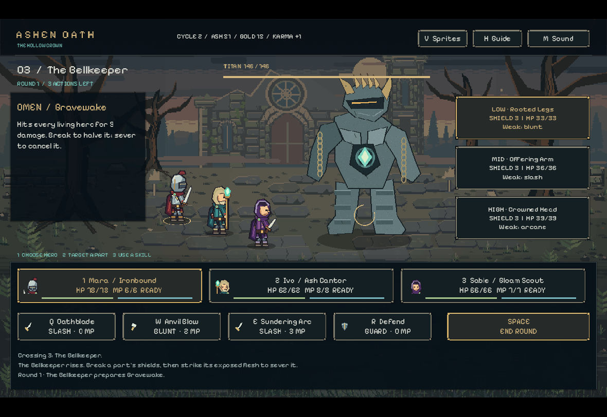

# ASHEN OATH — The Hollow Crown

[실제 플레이·비교 보고서](TEST_REPORT.html) · [빌드 방법](BUILDING.md) · [원작과 구분/출처](PROVENANCE.md)

오리지널 에셋·코드로 구현한 Godot 턴제 로그라이트입니다. The Severed Gods의 공식 공개 설명에서 확인한 부위별 방어 파괴와 절단, 파티 전투, 경로 선택과 윤회 성장의 핵심 루프를 참고했습니다. 원작의 전체 복제품이나 원작 분량에 상응하는 게임은 아닙니다.

## 실행
1. 공식 https://godotengine.org/download/ 에서 Godot **4.6 이상**을 설치합니다
2. 이 폴더의 `project.godot`를 열고 **F5**를 누릅니다
3. Godot가 PATH에 있으면 macOS/Linux `./run.sh`, Windows `run.bat`로 실행할 수도 있습니다

게임 UI는 영어입니다. 인터넷 연결·계정·외부 에셋은 실행 중 필요하지 않습니다. 이 ZIP은 소스 프로젝트입니다. 별도의 Windows/Linux 배포 ZIP에는 Godot 설치 없이 실행하는 게임 파일이 포함됩니다. Windows 빌드는 서명되지 않았으며 Windows에서의 실제 실행은 아직 검증하지 않았습니다.

## 플레이
- BEGIN A NEW CYCLE: 새 여정을 시작합니다
- 영웅 선택 → 적 부위 선택 → 스킬 사용 순서로 진행합니다
- 약점과 같은 속성으로 부위의 방어를 깨고, 해당 부위의 HP를 소진해 절단합니다
- 절단한 부위의 공격은 차단됩니다. OMEN에 다음 적 행동이 표시됩니다
- 살아 있는 각 영웅은 라운드당 한 번 행동합니다. End Round로 적 행동을 진행합니다
- 위험할 때 Guard를 사용합니다. MP는 라운드마다 회복됩니다
- 분기 경로에서 전투·휴식·카르마 사건을 선택하고 유물로 빌드를 강화합니다
- 여정 종료 후 얻은 Ash로 Vitality / Force / Focus 영구 강화를 구입합니다
- 9개 구간의 캠페인을 통과해 마지막 왕관을 무너뜨리세요

### 조작
| 입력 | 동작 |
|---|---|
| 마우스 클릭 | 모든 메뉴/선택/전투 |
| 1 / 2 / 3 | 영웅 선택 |
| 위 / 아래 방향키 | 부위 선택 |
| Q / W / E | 세 공격 스킬 |
| R | 방어 |
| Space | 라운드 종료 |
| H | 가이드 열기/닫기 |
| V | 4방향 캐릭터 스튜디오 |
| M | 효과음 음소거 |
| Esc | 메인 메뉴/복귀 |

스킬 위에 마우스를 올리면 자세한 효과가 표시됩니다. 시간 제한은 없습니다. 메인 메뉴를 열어도 현재 세션의 여정은 유지됩니다. **진행 중 여정과 영구 성장이 매 선택 후 자동 저장됩니다. 종료 후 RESUME CURRENT JOURNEY로 이어갈 수 있습니다.**

## 구현 범위
3명의 영웅, 각 3종 공격과 방어, 3개 부위 약점/실드/파괴/절단, 적 행동 예고, 분기 캠페인, 유물 보상, 카르마 사건, 영구 성장, 승리/패배와 재시작, 원시 파형 효과음, 코드로 직접 만든 독창적 픽셀 풍경·캐릭터, 공격 연출과 자동 저장.

## 원작과 구분
원작 캐릭터·이름·세계관·대사·아트·음악·실행 파일·소스 코드를 사용하지 않았습니다. 공개 Steam 페이지는 시스템 조사 출처일 뿐 배포 에셋이 아닙니다. 픽셀 그림은 tools/generate_art.py로 새로 만든 자산이며 원작 시각적 복제가 아닙니다.

원작 공식 페이지: https://store.steampowered.com/app/3755930/The_Severed_Gods/
개발사 공개 페이지: https://topeboxgames.itch.io/the-severed-gods
엔진 문서: https://docs.godotengine.org/en/4.6/tutorials/export/exporting_projects.html

## 검증
`TEST_REPORT.html`에서 실행한 검사와 미실행 범위를 확인하세요. headless 검사와 실제 native UI 플레이 검증을 구분해 기록했습니다. 첫 전투의 승리/보상과 재시작 후 저장 복구는 직접 키보드·마우스로 검증했습니다. 전체 9구간과 3보스의 직접 화면 완주도 검증했습니다. 승리 결과는 Ash 51 / Gold 153 / Karma +11이었습니다. 원작과의 동등 품질은 미달입니다.

## GitHub checkpoints
The user-created `buildon99x/ashen-oath` repository is public. The initial Godot ignore rules are preserved. Native Windows/Linux exports are built and independently backed up. Repository binary distribution is not yet complete; the source project runs in Godot 4.6+. Completed archive distributions include reconstruction instructions and SHA256 checksums. Source commits and actual gameplay evidence do not imply visual parity with the commercial reference.

## 4방향 애니메이션 · 체크포인트 4
세 영웅 모두 위·아래·왼쪽·오른쪽을 독립적으로 그렸습니다. 96×112 셀, 발 기준점 (48,101), 총 372프레임입니다. Idle 6프레임/6fps, Walk 8/10fps, Attack 8/12fps, Hurt 3/10fps, Death 6/8fps. 좌우를 단순 반전하지 않으며 무기 손과 장비 비대칭을 유지합니다.

V로 스튜디오를 열어 1/2/3 영웅 선택, 방향키 이동, Space 공격, H 피격, K 사망, R 초기화, P 일시정지를 시험할 수 있습니다. 버튼으로 동작·방향·속도와 프레임을 선택할 수 있습니다. Escape로 메뉴로 돌아간 뒤 Resume으로 진행 중 전투를 복구합니다.

배경 3종과 패널·속성 아이콘을 새로 만들고 Pixelify Sans(SIL OFL 1.1)를 적용했습니다. 실제 Linux 실행 파일에서 1180×812 창의 지도·사건·보스 전투·공격 후 파괴 상태·스튜디오 왕복 및 저장 복구를 확인했습니다. 스튜디오 1280×800 검증과 자동 애니메이션 1,131검사를 별도로 기록했습니다. 캐릭터 동작은 개선되었지만 원본 참고 이미지의 세밀한 수작업 표현, 원작의 적 다양성·입체 조명·연출 수준과는 차이가 있습니다.
