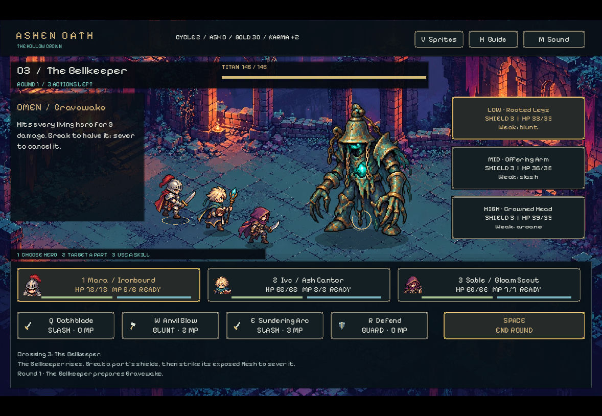
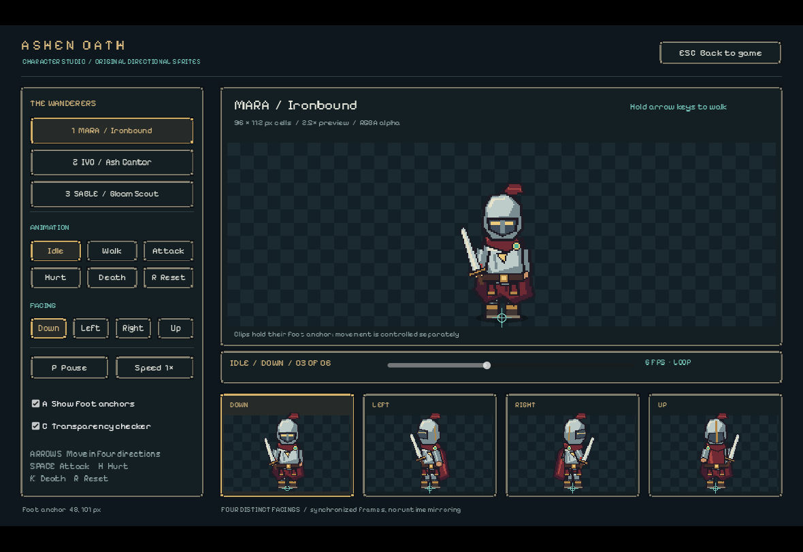
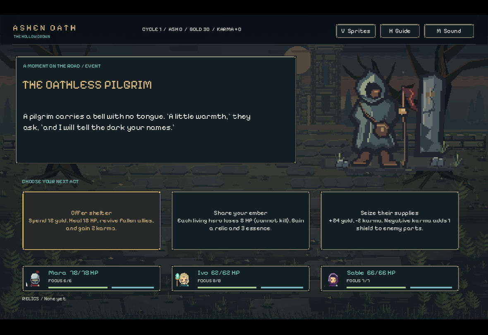
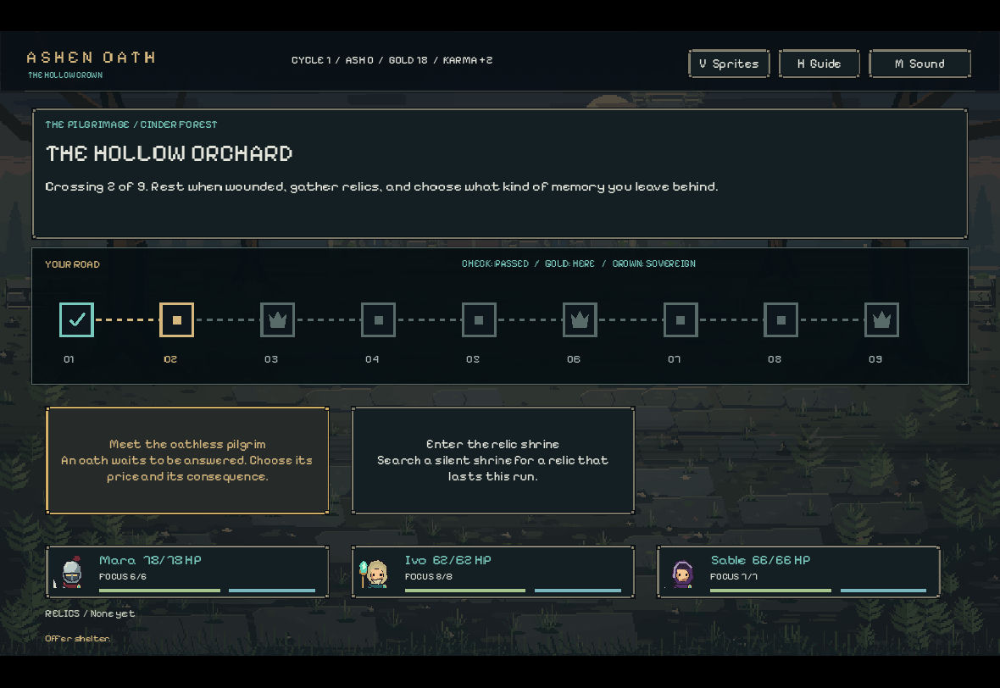

# ASHEN OATH — The Hollow Crown

[실제 플레이·비교 보고서](TEST_REPORT.html) · [빌드 방법](BUILDING.md) · [원작과 구분/출처](PROVENANCE.md)

오리지널 에셋·코드로 구현한 Godot 턴제 로그라이트입니다. The Severed Gods의 공식 공개 설명에서 확인한 부위별 방어 파괴와 절단, 파티 전투, 경로 선택과 윤회 성장의 핵심 루프를 참고했습니다. 원작의 전체 복제품이나 원작 분량에 상응하는 게임은 아닙니다.

## 최신 변경 · 체크포인트 9

두 번째 실제 9구간 완주에서 보스별 대응을 재검증했습니다. Judge는 단일/이중 판결을 번갈아 예고하고, Pale Sun은 준비/방출/회복 순환을 보여 줍니다. 추가 공격은 별도 부위에서 나오며 지정된 영웅의 Defend로 막을 수 있습니다. 파괴·절단은 각각 해당 공격을 약화·취소하며, 부위가 하나만 남으면 추가 공격이 생기지 않습니다. 보스 HP나 플레이어 피해 수치를 늘려 만든 난도는 아닙니다.

실제 확인: Judge의 추가 공격을 막은 뒤 주 공격의 2/4/4 피해가 예고와 일치했습니다. Pale Sun의 방출은 머리 절단과 지정 영웅 방어로 피해 없이 막았으며, 회복 턴에는 13→방어 7 피해와 Hollow Bell의 후속 3 회복을 확인했습니다. 최종 +53 Ash / Gold 174 / Karma +10. 이전 Ash 83을 포함한 보관량은 136이며 영구 강화는 0입니다. 진행 중인 이중 공격 저장 복구, 절단 부위를 건너뛰는 선택, Guide도 실제 화면으로 재검증했습니다.

최신 파일은 로컬 검증 소스입니다. 공개 저장소의 최신 반영은 승인 대기 중이며, 새 Windows/Linux 배포 실행 파일은 공식 export 템플릿 부재로 미완료입니다. 상용 롤모델 이상의 완성도에는 도달하지 않았습니다.

## 이전 변경 · 체크포인트 8

실제 전투 리뷰에서 OMEN이 파괴·절단 후에도 원래 피해를 표시하던 오류를 수정했습니다. 이제 영웅별 예상 피해·방어·행동 취소와 스킬별 피해/파괴/절단을 미리 확인할 수 있습니다. 남은 행동을 버리거나 진행 중 여정을 새로 시작할 때 확인 창이 뜹니다. 새 여정으로 포기한 Ash는 더 이상 영구 성장으로 전환되지 않으며, 실제 패배/승리 시의 정산은 유지됩니다. B에서 현재 유물 효과와 무기 강화·Ash를 확인합니다.

이번 소스로 9구간·3보스를 실제 키보드/마우스로 다시 완주했습니다. 영구 강화 0, 회복 보상 없이 일곱 전투의 적 피해 0을 기록했습니다. 이는 난도 검증에서 발견한 반복 차단 전략의 강함을 보여 주며 상용 품질 달성을 뜻하지 않습니다. 최종 Ash 83 / Gold 257 / Karma +17. 잘못된 적이 나타나던 승리 화면과 전체 유물 수집 후의 보상 안내도 수정하고 재실행해 확인했습니다. 공식 export 템플릿 부재로 최신 실행 파일 배포는 여전히 미완료입니다.

## 이전 변경 · 체크포인트 7

이미지 생성 도구로 제작한 세 영웅의 12개 독립 방향 포즈와 몬스터 3종을 실제 게임에 적용했습니다. 전투·지도·사건의 초상화도 같은 그림을 사용합니다. 4방향과 Idle/Walk/Attack/Hurt/Death 타이밍은 유지하고, 움직임은 엔진 내 메시 리그로 연결했습니다. 372장의 새 개별 생성 프레임이라는 뜻은 아닙니다. 기존 절단 규칙과 새로운 몬스터의 머리·팔·다리 표시를 연결했습니다.

체크포인트 7 당시 소스와 native Godot 프로젝트 화면을 검증했습니다. 공식 export 템플릿이 없어 새 Windows/Linux 배포 실행 파일은 아직 만들지 못했습니다. 기존 실행 파일 백업은 체크포인트 5이며 새 배경과 캐릭터를 포함하지 않습니다.

## 실행
1. 공식 https://godotengine.org/download/ 에서 Godot **4.6 이상**을 설치합니다
2. 이 폴더의 `project.godot`를 열고 **F5**를 누릅니다
3. Godot가 PATH에 있으면 macOS/Linux `./run.sh`, Windows `run.bat`로 실행할 수도 있습니다

게임 UI는 영어입니다. 인터넷 연결·계정·외부 에셋은 실행 중 필요하지 않습니다. 이 ZIP은 소스 프로젝트입니다. 별도의 Windows/Linux 배포 ZIP에는 Godot 설치 없이 실행하는 게임 파일이 포함됩니다. Windows 빌드는 서명되지 않았으며 Windows에서의 실제 실행은 아직 검증하지 않았습니다.

## 플레이
- BEGIN A NEW CYCLE: 새 여정을 시작합니다
- 영웅 선택 → 적 부위 선택 → 스킬 사용 순서로 진행합니다
- 약점과 같은 속성으로 부위의 방어를 깨고, 해당 부위의 HP를 소진해 절단합니다
- 절단한 부위의 공격은 차단됩니다. OMEN에 다음 적 행동이 표시됩니다
- 살아 있는 각 영웅은 라운드당 한 번 행동합니다. End Round로 적 행동을 진행합니다
- 위험할 때 Guard를 사용합니다. MP는 라운드마다 회복됩니다
- 분기 경로에서 전투·휴식·카르마 사건을 선택하고 유물로 빌드를 강화합니다
- 여정 종료 후 얻은 Ash로 Vitality / Force / Focus 영구 강화를 구입합니다
- 9개 구간의 캠페인을 통과해 마지막 왕관을 무너뜨리세요

### 조작
| 입력 | 동작 |
|---|---|
| 마우스 클릭 | 모든 메뉴/선택/전투 |
| 1 / 2 / 3 | 영웅 선택 |
| 위 / 아래 방향키 | 부위 선택 |
| Q / W / E | 세 공격 스킬 |
| R | 방어 |
| Space | 라운드 종료 |
| H | 가이드 열기/닫기 |
| B | 현재 유물·빌드·Ash 확인 |
| V | 4방향 캐릭터 스튜디오 |
| M | 효과음 음소거 |
| Esc | 메인 메뉴/복귀 |

스킬 위에 마우스를 올리면 자세한 효과가 표시됩니다. 시간 제한은 없습니다. 메인 메뉴를 열어도 현재 세션의 여정은 유지됩니다. **진행 중 여정과 영구 성장이 매 선택 후 자동 저장됩니다. 종료 후 RESUME CURRENT JOURNEY로 이어갈 수 있습니다.**

## 구현 범위
3명의 영웅, 각 3종 공격과 방어, 3개 부위 약점/실드/파괴/절단, 적 행동 예고, 분기 캠페인, 유물 보상, 카르마 사건, 영구 성장, 승리/패배와 재시작, 원시 파형 효과음, 직접 만든 풍경·UI와 이미지 생성 도구로 제작한 캐릭터·몬스터, 공격 연출과 자동 저장.

## 원작과 구분
원작 캐릭터·이름·세계관·대사·아트·음악·실행 파일·소스 코드를 사용하지 않았습니다. 공개 Steam 페이지는 시스템 조사 출처일 뿐 배포 에셋이 아닙니다. 초기 픽셀 그림은 tools/generate_art.py로 만들었고, 최신 전투 배경·영웅·몬스터는 이미지 생성 도구로 제작한 자산입니다. 원작의 원본 에셋은 포함하지 않습니다.

원작 공식 페이지: https://store.steampowered.com/app/3755930/The_Severed_Gods/
개발사 공개 페이지: https://topeboxgames.itch.io/the-severed-gods
엔진 문서: https://docs.godotengine.org/en/4.6/tutorials/export/exporting_projects.html

## 검증
`TEST_REPORT.html`에서 실행한 검사와 미실행 범위를 확인하세요. headless 검사와 실제 native UI 플레이 검증을 구분해 기록했습니다. 첫 전투의 승리/보상과 재시작 후 저장 복구는 직접 키보드·마우스로 검증했습니다. 전체 9구간과 3보스의 직접 화면 완주도 검증했습니다. 승리 결과는 Ash 51 / Gold 153 / Karma +11이었습니다. 원작과의 동등 품질은 미달입니다.

## GitHub checkpoints
The user-created `buildon99x/ashen-oath` repository is public. The initial Godot ignore rules are preserved. Native Windows/Linux exports are built and independently backed up. Repository binary distribution is not yet complete; the source project runs in Godot 4.6+. Completed archive distributions include reconstruction instructions and SHA256 checksums. Source commits and actual gameplay evidence do not imply visual parity with the commercial reference.

## 4방향 애니메이션 · 체크포인트 4
세 영웅 모두 위·아래·왼쪽·오른쪽을 독립적으로 그렸습니다. 96×112 셀, 발 기준점 (48,101), 총 372프레임입니다. Idle 6프레임/6fps, Walk 8/10fps, Attack 8/12fps, Hurt 3/10fps, Death 6/8fps. 좌우를 단순 반전하지 않으며 무기 손과 장비 비대칭을 유지합니다.

V로 스튜디오를 열어 1/2/3 영웅 선택, 방향키 이동, Space 공격, H 피격, K 사망, R 초기화, P 일시정지를 시험할 수 있습니다. 버튼으로 동작·방향·속도와 프레임을 선택할 수 있습니다. Escape로 메뉴로 돌아간 뒤 Resume으로 진행 중 전투를 복구합니다.

배경 3종과 패널·속성 아이콘을 새로 만들고 Pixelify Sans(SIL OFL 1.1)를 적용했습니다. 실제 Linux 실행 파일에서 1180×812 창의 지도·사건·보스 전투·공격 후 파괴 상태·스튜디오 왕복 및 저장 복구를 확인했습니다. 스튜디오 1280×800 검증과 자동 애니메이션 1,131검사를 별도로 기록했습니다. 캐릭터 동작은 개선되었지만 원본 참고 이미지의 세밀한 수작업 표현, 원작의 적 다양성·입체 조명·연출 수준과는 차이가 있습니다.

## 지도·사건 화면 · 체크포인트 5
전투 밖 화면에도 같은 배경·패널·초상화·HP/MP 시각 체계를 적용했습니다. 지도는 지난 구간 체크, 현재 위치 금색 테두리, 보스 왕관을 구분합니다. 캠프·신전·순례자·보상 삽화 네 장을 직접 만들었습니다. 실제 Linux 실행 파일에서 사건 선택 → 골드/카르마 반영 → 지도 진행 → 신전 → Escape 왕복을 검증했습니다. UI 검사 82개 통과.

## 이미지 생성 전투 배경 · 체크포인트 6
사용자가 제공한 배경 참고 이미지의 인디고 그림자·청록 석재·주황 불빛을 바탕으로 내장 이미지 생성 도구에서 새로운 가로형 폐허 안뜰을 제작했습니다. 전투 화면에 적용하고 중앙 바닥을 캐릭터용으로 비웠습니다. 원본 PNG는 별도 보존, 프로젝트에는 같은 픽셀 크기의 WebP(quality90)를 사용합니다. 캐릭터/UI를 합성한 그림이 아니라 실제 Godot 실행 창을 위에 첨부했습니다.

최종 소스의 native 실행·공격·재시작 복구 및 전체 자동 검사가 통과했습니다. **이 체크포인트의 새 실행 파일은 만들지 못했습니다. 공식 export template 복구가 중단되어 기존 실행 파일 백업은 체크포인트 5입니다.** 최신 배경은 Godot에서 이 소스를 실행하면 보입니다.

## 체크포인트 7 확인
- 자동 검사: 규칙 78, UI 82, 저장 7, 기존 애니메이션 1,131, 생성 아트 177 통과
- 캠페인: 50개 시드의 규칙 기반 진행, 모두 정상 종료
- 화면: 실제 native Godot 창에서 전투 공격·다리 절단, 세 영웅의 4방향 스튜디오와 이동/공격/피격/사망/초기화 확인
- 한계: 12개 포즈에 연결한 리그 애니메이션으로, 개별 손그림 프레임보다 움직임이 제한적입니다. 상용 원작 동등 품질은 주장하지 않습니다.
